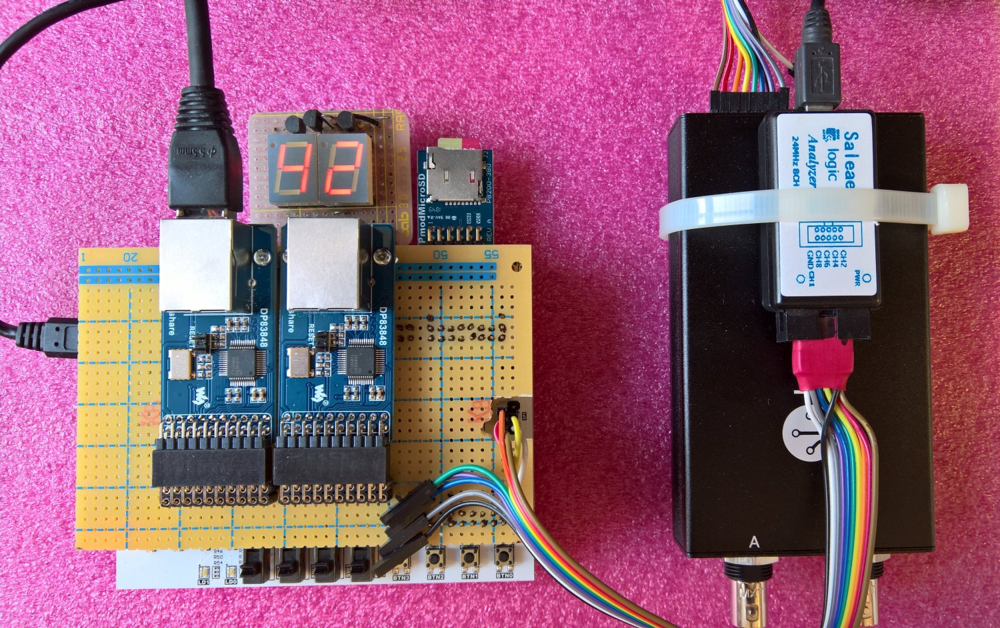
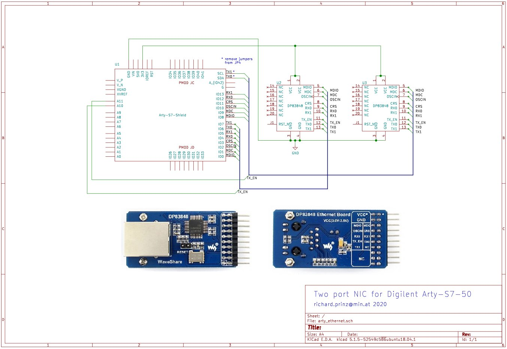

# Arty-S7-50, 2x NIC, VexRisc, Migen
This project describes how to build a soft-core Risc based system with 2
Ethernet interfaces on a Digilent Arty-S7-50 with a Xilinx Spartan 7 FPGA using
Python based Migen HDL.





It uses two [Texas Instruments DP83848](http://www.ti.com/product/DP83848-EP)
based RMII Ethernet PHYs from [Waveshare](https://www.waveshare.com/dp83848-ethernet-board.htm).
In addition a [SD-Card PMOD](https://store.digilentinc.com/pmod-microsd-microsd-card-slot/)
and a simple [seven segment display](source/disp7/readme.md) completes the
system.

More infos about this project on the [accompanying blog post](https://www.min.at/prinz/?x=entry:entry200428-150015).

## Prerequisites
To build the FPGA bitstream, the SoC BIOS and the sample bare metal demo
application you need some prerequisites installed:

* [Xilinx Vivado](https://www.xilinx.com/products/design-tools/vivado.html)
* [Python >= 3.6](https://www.python.org/)
* [LiteX](https://github.com/enjoy-digital/litex)
* [RiscV compiler toolchain](https://static.dev.sifive.com/dev-tools/riscv64-unknown-elf-gcc-8.1.0-2019.01.0-x86_64-linux-ubuntu14.tar.gz)
* [xc3sprog](https://sourceforge.net/projects/xc3sprog/)

## Building
The included `make.py` script is responsible for building and loading/flashing.
In addition a `Makefile` is used to handle dependencies and file changes.
Assuming that all prerequisites are correctly installed using make:
```
make                Builds FPGA bitstream
make conv           Convert Python FHDL to Verilog
make load           Loads bitstream into FPGA via serial port
make reload         Same as "load" but does not rebuild in case of changes
make flash          Stores bitstream into FPGA boot flash
make reflash        Same as "flash" but does not rebuild in case of changes
make term           Opens LiteX serial lxterm console
make load-sw        Loads firmware binary using serial port
make clean          Cleans/removes all build artefacts
```
The `make.py` script is called from make (Makefile) and provides the following:
```
make.py --help      shows basic help
make.py build       converts LiteX/Migen FHDL into verilog,
                    starts Xilinx Vivado and generates FPGA bitstream
make.py load        loads the bitstream into FPGA
make.py flash       flashes the bitstream into config flash
make.py conv        creates all artefacts (verilog, c sources etc.)
                    but does not compile
```
In addition to the FPGA bitstream (which also includes the BIOS) a sample
application is included in the `firmware` directory. It can be compiled with
the included Makefile. The resulting `firmware.bin` can be loaded from SD-Card
or via TFTP from a server.

To load from SD-Card create a FAT16 partition on it and place `firmware.bin`
renamed to `boot.bin` in the root directory.

To load from TFTP server connect Ethernet interface 1 to a switch or directly
to a host via a cros-over network cable. Interface 1 is per default configured
with IP4 address **10.0.0.50** and tries to load from TFTP server with address
**10.0.0.100**. These addresses are static and can only be changed by modifying
`top.py` and re-building.
Place `firmware.bin` renamed to `BOOT.BIN` in the root directory of the TFTP
server.

## Running
Build and flash the bitstream. Place `boot.bin` for example on the SD-Card and
reset the board. On an attached serial terminal you should see the following
output:
```
[LXTERM] Starting...
        __   _ __      _  __
       / /  (_) /____ | |/_/
      / /__/ / __/ -_)>  <
     /____/_/\__/\__/_/|_|
   Build your hardware, easily!

 (c) Copyright 2012-2020 Enjoy-Digital
 (c) Copyright 2007-2015 M-Labs

 BIOS built on May  1 2020 22:04:43
 BIOS CRC passed (f662f7bd)

 Migen git sha1: --------
 LiteX git sha1: 56aa7897

--=============== SoC ==================--
CPU:       VexRiscv @ 100MHz
ROM:       32KB
SRAM:      4KB
L2:        8KB
MAIN-RAM:  262144KB

--========== Initialization ============--
Ethernet init...
Initializing SDRAM...
SDRAM now under software control
Read leveling:
m0, b0: |00000000000000000000000000000000| delays: -
m0, b1: |00000000000000000000000000000000| delays: -
m0, b2: |00000000000000000000000000000000| delays: -
m0, b3: |00000000000000000000000000000000| delays: -
m0, b4: |00000000000000000000000000000000| delays: -
m0, b5: |00000000000000000000000000000000| delays: -
m0, b6: |00001111111111111000000000000000| delays: 10+-06
m0, b7: |00000000000000000000000000000000| delays: -
best: m0, b6 delays: 10+-06
m1, b0: |00000000000000000000000000000000| delays: -
m1, b1: |00000000000000000000000000000000| delays: -
m1, b2: |00000000000000000000000000000000| delays: -
m1, b3: |00000000000000000000000000000000| delays: -
m1, b4: |00000000000000000000000000000000| delays: -
m1, b5: |10000000000000000000000000000000| delays: 00+-00
m1, b6: |00001111111111111000000000000000| delays: 10+-06
m1, b7: |00000000000000000000000000000000| delays: -
best: m1, b6 delays: 10+-06
SDRAM now under hardware control
Memtest OK
Memspeed Writes: 262Mbps Reads: 327Mbps

--============== Boot ==================--
Booting from serial...
Press Q or ESC to abort boot completely.
sL5DdSMmkekro
Timeout
SD Card via SPI Initialising
Reading MBR
Partition 1 Information: Active=0x00, Type=0x06, LBAStart=0x00000800
Partition 1 is FAT16

Read FAT16 Boot Sector
  Jump Code:              0xeb 0x3c 0x90
  OEM Code:               [mkfs.fat]
  Sector Size:            512
  Sectors Per Cluster:    128
  Reserved Sectors:       128
  Number of Fats:         2
  Root Dir Entries:       2048
  Total Sectors Short:    0
  Media Descriptor:       0xf8
  Fat Size Sectors:       128
  Sectors Per Track:      32
  Number of Heads:        64
  Hidden Sectors:         2048
  Total Sectors Long:     4194304
  Drive Number:           0x80
  Current Head:           0x01
  Boot Signature:         0x29
  Volume ID:              0x3fab9b48
  Volume Label:           [LITEX      ]
  Volume Label:           [FAT16   ]
  Boot Sector Signature:  0xaa55

Reclocking from 400KHz to 14285KHz

sdCardFatTable = 0x4fff0000  Reading Fat16 Table (128 Sectors Long)

sdCardFat16RootDir = 0x4ffe0000  Reading Root Directory (128 Sectors Long)


Root Directory
  File 1 [BOOT    .BIN] @ Cluster 3 for 9532 bytes

Reading File [BOOT.BIN] into 0x40000000 : File starts at Cluster 3 length 9532
Clusters: 3

Executing booted program at 0x40000000

--============= Liftoff! ===============--
Hello firmware booting...

HELLO>
```
After board reset the embedded BIOS is started which performs some basic
initalization and then tries to load the firmware via available peripherals.
In this case first via serial port, then via SD-Card and last via Ethernet.
It found the BOOT.BIN `hello` firmware on the SD-Card and loads it.

```
HELLO>help
Available commands:
display value  - Display 8bit values on 7Segment display on PMOD-D
reboot         - reboot CPU
help           - this command
HELLO>
HELLO>display 128
HELLO>
```

The `hello` firmware just shows how to develop bare metal applications using
console in- and output and accessing FPGA logic blocks like the seven segment
display. The `display` command takes a decimal value between 0 and 255 and
displays it's hex representation on the LED display. The `hello` command
returns the entered value xor-ed with 0xff from the FPGA.

## Caveats
Building the bitstream and loading it with xc3sprog did not work out of the
box for the Arty-S7-50.

* The latest LiteX Liteeth RMII and MAC implementation does not support multiple
Ethernet interfaces due to limitations in clock domain handling and requires
an explicit negative PHY reset (not directly available on the used PHY boards).
Two simple patches to `liteeth/phy/rmii.py` and `liteeth/mac/core.phy` fixed this.

They can be found on github:
* [Reset patch](https://github.com/rprinz08/liteeth/commit/6ac06a8423d326f111316909a07afba65db71fe0)
* [Multy RMII PHY patch](https://github.com/rprinz08/liteeth/commit/ed355c5aae09e2234098910da4ee220956210371)

* Also `xc3sprog` did not support the Xilinx Spartan-7 chip used on the
Arty-S7-50. For this to work another patch was developed. Simple get the source
from [here](https://sourceforge.net/projects/xc3sprog/) and add the following line
to the file `devlist.txt`:
```
0362f093      6    0x09 XC7S50
```
Then rebuild `xc3sprog` which now can be used to program the Arty-S7-50.

More infos about this project can be found on the
[accompanying blog post](https://www.min.at/prinz/?x=entry:entry200428-150015).

